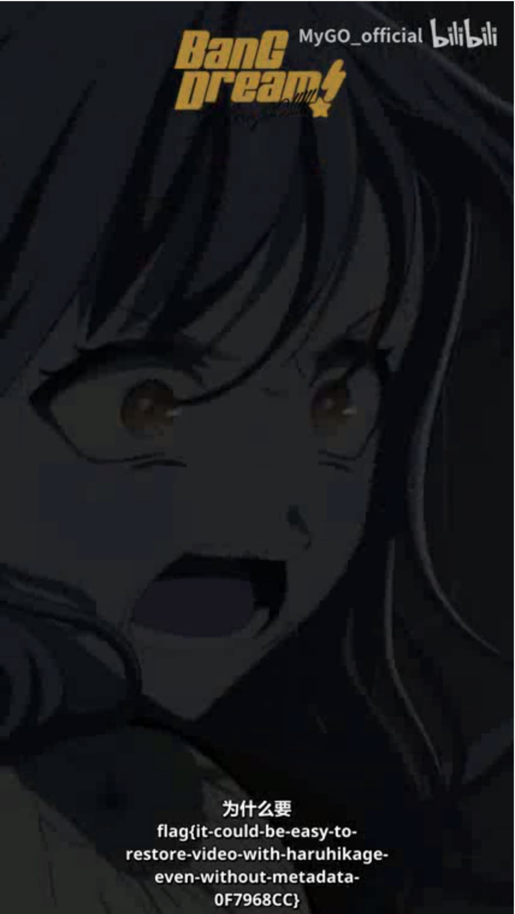

# 🪐 流式星球

题解作者：[RTXUX](https://github.com/RTXUX)

出题人、验题人、文案设计等：见 [Hackergame 2023 幕后工作人员](https://hack.lug.ustc.edu.cn/credits/)。

## 题目描述

- 题目分类：general

- 题目分值：200

> 包含 AI 辅助创作


茫茫星系间，文明被分为不同的等级。每一个文明中都蕴藏了一种古老的力量 —— flag，被认为是其智慧的象征。

你在探索的过程中意外进入了一个封闭空间。这是一个由神秘的流式星人控制着的星球。星球的中心竖立着一个巨大的三角形任务牌，上面刻着密文和挑战。

流式星人用流式数据交流，比如对于视频来说，他们不需要同时纵览整个画面，而是直接使用像素流。为了方便理解，你把这个过程写成了一个 Python 脚本（见附件），flag 就藏在这个视频（见附件）中。尽管最后丢掉了一部分数据，你能把 flag 还原出来吗？

**[Python 脚本](./src/create_video.py)**

**[视频像素流文件](https://ftp.lug.ustc.edu.cn/~rtxux/0bd1f9a2-ccab-449c-b95c-af57f7ebc91e/video.bin)**

## 题解

使用 GPT4 写出下面代码，播放该视频流，固定高度并调整宽度直到画面看似正常，然后调整高度直到画面稳定，截取最后一帧即可获得 flag。

```python
import sys
import numpy as np
from PyQt6.QtCore import Qt, QTimer
from PyQt6.QtGui import QImage, QPixmap
from PyQt6.QtWidgets import QApplication, QLabel, QMainWindow, QSlider, QVBoxLayout, QHBoxLayout, QWidget, QSizePolicy

class VideoPlayer(QMainWindow):
    def __init__(self, video_stream: np.ndarray, width=637, height=355, fps=30):
        super().__init__()

        self.width = width
        self.height = height
        self.video_stream = video_stream
        self.frame_index = 0

        self.initUI()

        self.timer = QTimer()
        self.timer.timeout.connect(self.update_frame)
        self.timer.start(int(1000.0 / fps))  # Update at 60 fps

    def initUI(self):
        self.image_label = QLabel()
        self.image_label.setSizePolicy(QSizePolicy(QSizePolicy.Policy.Expanding, QSizePolicy.Policy.Expanding))
        self.image_label.setAlignment(Qt.AlignmentFlag.AlignCenter)

        self.width_slider = QSlider(Qt.Orientation.Horizontal)
        self.height_slider = QSlider(Qt.Orientation.Horizontal)

        self.width_label = QLabel()
        self.width_label.setText(f"Width: {self.width}px")
        self.width_slider.setMinimum(100)
        self.width_slider.setMaximum(1000)
        self.width_slider.setValue(self.width)
        self.width_slider.valueChanged.connect(self.update_width)

        self.height_label = QLabel()
        self.height_label.setText(f"Height: {self.height}px")
        self.height_slider.setMinimum(100)
        self.height_slider.setMaximum(1000)
        self.height_slider.setValue(self.height)
        self.height_slider.valueChanged.connect(self.update_height)

        layout = QVBoxLayout()
        layout.addWidget(self.image_label)
        width_bar = QHBoxLayout()
        width_bar.addWidget(self.width_label)
        width_bar.addWidget(self.width_slider)
        height_bar = QHBoxLayout()
        height_bar.addWidget(self.height_label)
        height_bar.addWidget(self.height_slider)
        layout.addLayout(width_bar)
        layout.addLayout(height_bar)

        widget = QWidget(self)
        self.setCentralWidget(widget)
        widget.setLayout(layout)

    def update_width(self, value):
        self.width = value
        self.width_label.setText(f"Width: {self.width}px")
        self.frame_index = 0
        self.update_frame()

    def update_height(self, value):
        self.height = value
        self.height_label.setText(f"Height: {self.height}px")
        self.frame_index = 0
        self.update_frame()

    def update_frame(self):
        frame = self.get_next_frame()
        if frame is not None:
            image = QImage(frame.data, self.width, self.height, self.width * 3, QImage.Format.Format_RGB888)
            pixmap = QPixmap(self.width, self.height)
            pixmap.convertFromImage(image, Qt.ImageConversionFlag.DiffuseDither)
            self.image_label.setPixmap(pixmap)

    def get_next_frame(self) -> np.ndarray:
        total_pixels = self.width * self.height
        if (self.frame_index + 1) * total_pixels > len(self.video_stream):
            self.frame_index = 0  # Repeat the video

        start = self.frame_index * total_pixels
        end = (self.frame_index + 1) * total_pixels
        self.frame_index += 1
        return self.video_stream[start:end, :]


if __name__ == "__main__":
    video_stream = np.fromfile(sys.argv[1], dtype=np.uint8)
    a = len(video_stream) // 3 * 3
    video_stream = video_stream[:a]
    video_stream = video_stream.reshape((-1, 3))
    app = QApplication(sys.argv)
    player = VideoPlayer(video_stream, fps=30)
    player.show()
    app.exec()
```

视频分辨率为 `427 x 759`。



## 其他

@taoky: 这道题的 demo 弄好之后，我们想拿类似于去年 Sakana~（Lycoris Recoil）这样最新最热的视频切片来做，然后选「为什么要弹春日影」这段是我提议的（因为长度挺合适的，而且也属于 fair use 的范畴。不过或许我是导致今年 MyGO 浓度过高的直接原因？），[从 B 站下载](https://www.bilibili.com/video/BV19F411y7FA/)之后我也拿 aegisub 糊了个 ass 格式的字幕。
