# Hackergame2023 writeup By xxuurruuii

个人性质的writeup（带有私货）

### Hackergame 启动

签到题，注意到链接里有 ```/?similarity=``` ，把后面的数字改成100就过了

你说得对，但是Hackergame是一款后面忘了

### 猫咪小测

简单搜索题

第一问搜不出来，但是可以穷举，答案是12

第二问很好搜，丢百度就能看到一篇讲这个的知乎文章，答案是23

第三问我用的是gpt，众所周知gpt是新时代非常有效的搜索工具（乐），那么他提供的答案也是正确的：


第四问直接搜索并不容易，甚至还能搜到某老哥在各大百度贴吧询问的帖子，但是注意到这首先是一篇论文，所以我们可以去专门搜论文的网页（我用的是谷歌学术）搜索关键词，能看到一篇讲py类型检查图灵完备的论文，就是我们要的答案。


### 更深更暗

阅读题干能知道我们需要往下翻到底来获得flag，但是简单翻了翻会意识到几乎没法翻到底，因此可以打开f12阅读网页源代码来获取flag。简单题


### 旅行照片 3.0

社工题，我完全不会的类型，所以只做了第一问

将奖牌的图片丢入搜图可以得到是诺贝尔物理学奖，再搜索人名知是 小柴昌俊 ，接下来就是在维基上翻阅信息找到第二小问的答案；第一问实在没思路，好在已知是今年暑假所以直接穷举过去了（

### 赛博井字棋

正常手段一定是赢不了的，所以这题我们要打开f12研究一下js。注意到点击已经有棋子的地方时console栏会报错，我们根据报错跳转到对应位置可以看到下棋的相关代码。


不难猜出 ```await setMove(x,y)``` 就是下棋相关指令，那不如复制几份一次多下几个棋（这里要用到google chrome的override功能来覆盖js文件）：


然后刷新网页，重新开局，在任意处点一下就会一次下3个棋，非常顺利地取得了胜利

小趣事：flag里写的是 ```I_can_eat_your_pieces``` ，但是我做完了也不知道怎么吃子（

### 奶奶的睡前 flag 故事

题干非常贴心地提供了加粗文本，搜索谷歌、系统升级、截图等关键词可以发现一个截图漏洞可以还原图片信息，进一步搜索能发现 [aCropalypse](https://acropalypse.app/) 这个专门恢复此类图片信息的网站，**调整预设图片宽度**后把图片丢进去就能看到恢复的信息。

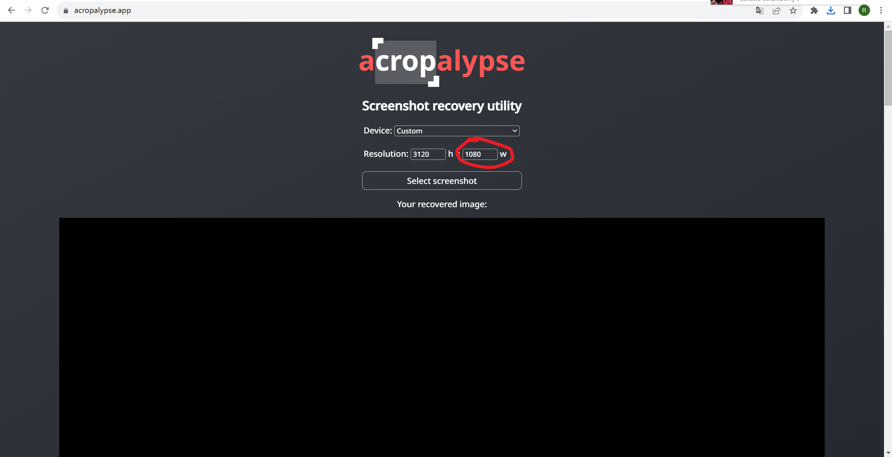

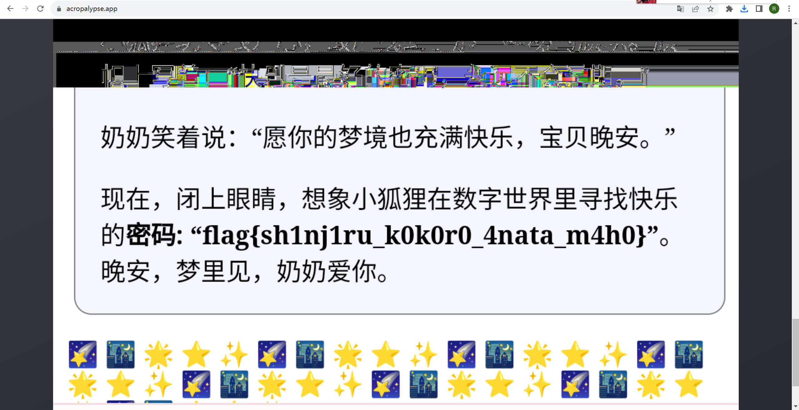

设置图片宽度非常重要！我一开始没在意这个宽度然后啥也没提取出来，还以为我思路错了（恼）

### 组委会模拟器

这题也是要修改js文件，先ctrl+f搜索“撤回”跳转到相关代码处，就能看到涉及网页添加消息和点击撤回的代码。把点击撤回的那部分代码复制进网页添加消息里面，加个if就能让网页显示消息后自动撤回。~~虽然这样视觉效果上没撤回，但是实际上已经发送了撤回的网络请求所以管他呢~~


### 虫

一眼sstv，在网上下载mmsstv然后接个虚拟声卡把外放声音接回去就做出来了

ccbc12也有个[sstv题](https://archive.cipherpuzzles.com/index.html#/problem?c=ccbc12/problems/e/p2021)，~~所以你们到底是ctf比赛还是puzzlehunt比赛~~

这就是puzzlehunt给我的自信.jpg

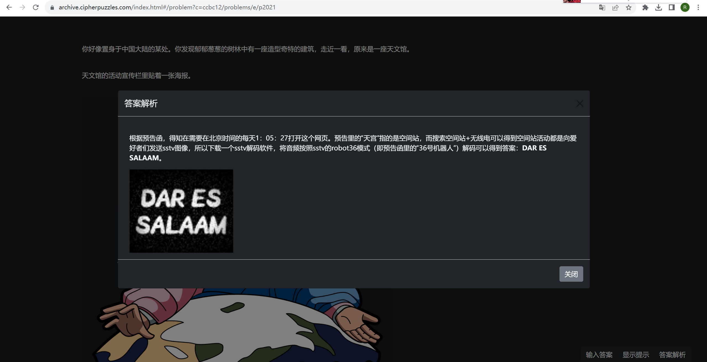

### 惜字如金 2.0

拿到代码处理完几个assert后会发现这题的核心在```get_cod_dict()```中，```cod_dict```的每一项都只有23长度，而```check_equals()```告诉我们本应该是每一项有24长度。不难发现每一项都恰好删去了一个字符，我们不妨试试在最前面和最后面加入一个无关字符（这里用@表示）看看得到了什么输出（当然，运行程序前先把最后的两个```check_equals```删了）：


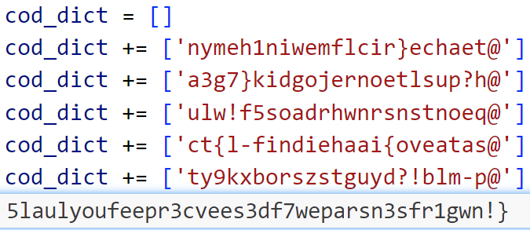

因为```cod_dict```中每一项都只删去了一个字符，所以最终的flag每个位置的字符必定在以上两种情况之一，或者是e。作为一个懒得写代码的人，我开始手动拖@条来凑flag。@都在左边的时候```ftag{ng@-v}-ealovmrai-ghm-@n5war-ehdht?7```有非常明显的特征，开头有个t不太对，所以把第二个@拉到最右边看看：

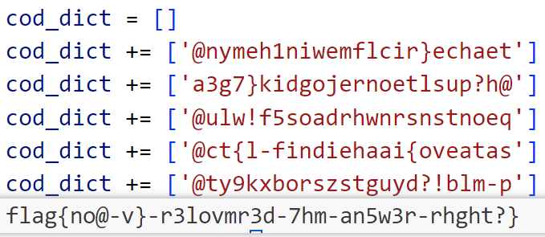

看起来已经离正确答案不远了！此时我们再对照一下“可能出现的字符列表”：


此时flag基本上已经能爆了，大概猜一猜就是you-ve-recovered-the-answer-right，符合题意且都在“可能出现的字符列表”里，答案正确。

### 🪐 高频率星球

这题一来先拍一个asciinema到我脸上，我捣鼓了半天发现windows好像用不了asciinema（。

怎么办呢，只能硬着头皮打开rec文件了。打开一看这个文件意外地很可读，第一行是一个字典表示文件信息，后面若干行每一行都是三个数据，前两个不知道，第三个是要显示在屏幕上的东西。那就简单了，写一个程序读取每一行的列表第三项拼起来直接写进一个文件，然后打开检查一下。打开好像有一些乱码，应该是rec文件的格式部分，用记事本自带的查找替换功能删一下就行。这样当然没法用sha256校验了，不过幸运的是得到的js文件跑出了flag。

↓用记事本替换导致代码里有空行

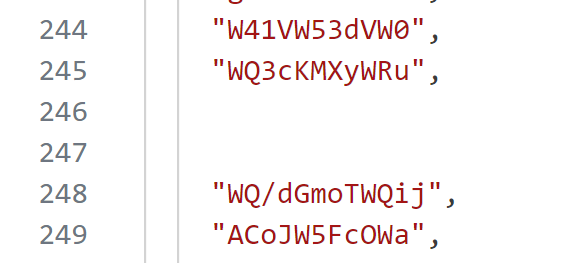

### 🪐 低带宽星球

第一问网上随便搜一个png压缩网站就能过，限制给的很宽。

第二问尝试了很多种文件格式，包括写了个200B的svg，不过最后以失败告终。（50B到底是什么神秘东西）

### 异星歧途

~~怎么ctf还能塞Mindustry题，下次就要往puzzlehunt塞shapez题了~~

按照指示下载Mindustry并打开地图，跑到按钮旁边晃悠能发现一个微型处理器，点了之后会出现一堆紫色菱形和一个编辑按钮。

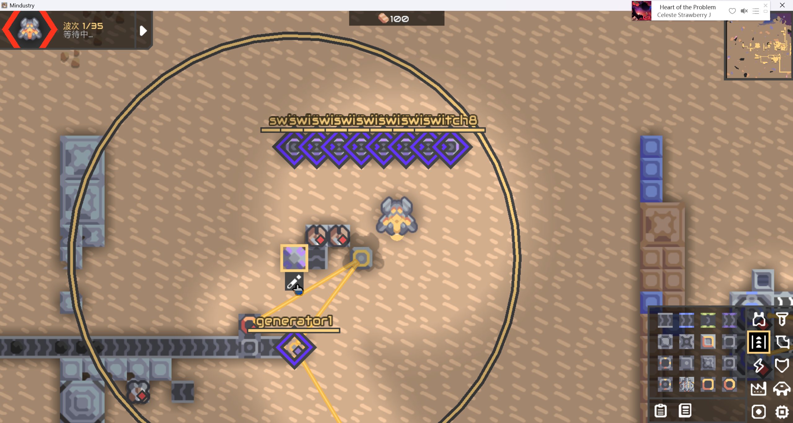

点开编辑窗口就能看到代码，于是知道了这题是阅读代码然后更改开关满足条件。

第一题熟悉编程语言，简单题，这些jump条件一个都不能满足所以反着点就行

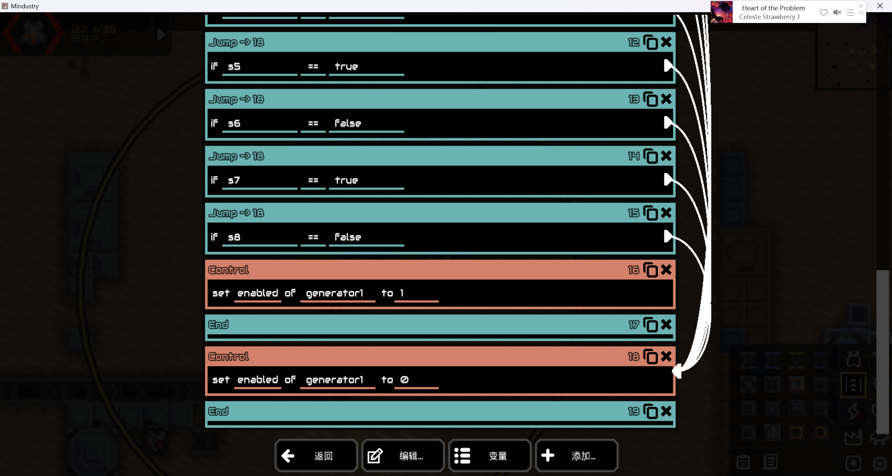

第二题是一个数学题，用按钮输入一个二进制数，要求```sw1==1```，```sw6==1```，整个数是一个平方数，逐个尝试得答案是14^2


第四题是一个用机械造的门电路，摸几下观察状态就能把每个部分的作用摸出来，然后倒推即可


第三题也是机械题，而且很容易炸（！），搞的我重新加载存档搞了很多次。

先看到```nsw3```可以关闭反应堆，先把```sw3```打开以方便后续操作。

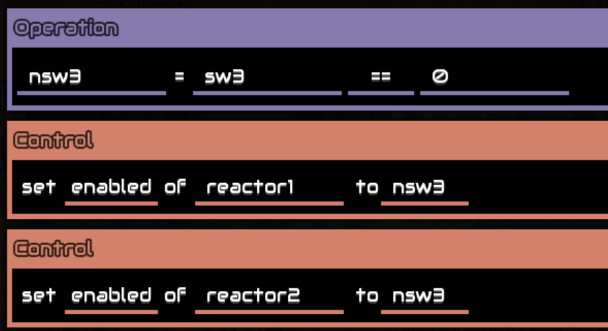

```sw1```控制粉色原料进入，```sw2```控制蓝色原料不进入，```sw5```开启混合器，```sw6```开启抽水机，这些分别调整开关。```sw8```如果和```sw9```（第二题的最后一位）不一样会强制开启反应堆并使其爆炸，不能动。

```sw7```会打开两个meltdown，疑似会使抽水机电力不足。


```sw4```会使冷却液泄露，不能开。

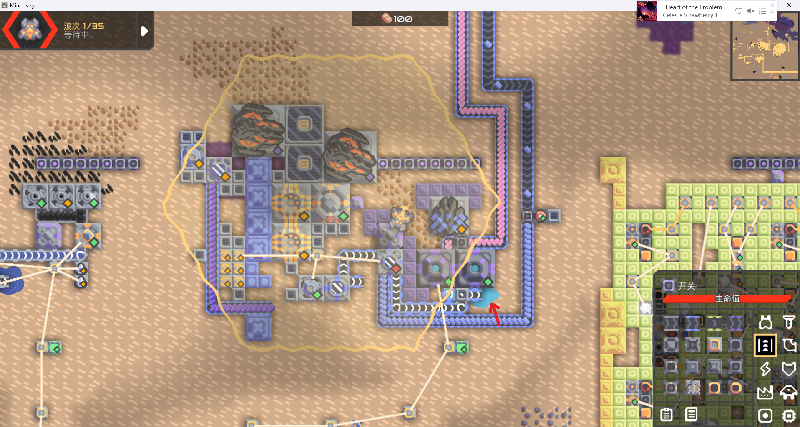

调整完后关闭```sw3```，一切都运行正常，答案正确。

### 小 Z 的谜题

阅读程序知道这题实际上是要把16个长方体积木（形状和数量见代码）塞进一个5*5*5的箱子，而且体积刚好相等，最后按一个神秘公式计算```score```然后判定做出了第几小问。我刚拿到这题的时候先手跑了一个解法出来，144分，抢到了第一问的首杀。


当我知道这个解法144分的时候我就意识到不对劲，第二问要136分以下，第三问要157分以上，看起来非常极限，怎么看都不像是我再手跑一个解就能跑出来的，所以我当时把这题丢了做别的题去了。

然后我突然想到：诶拼图不是NP问题吗，我为啥不写个sat-solver暴力跑呢？之前有段时间我闲着没事在研究sat-solver，顺便帮朋友的新游戏[808s&Genetics](https://store.steampowered.com/app/2550630/808sGenetics/)写了个解题器和出题器，所以有一点写solver的经验。于是我动手写了个solver，因为分数不好量化为规则，所以我采取了跑出解后检查score，删除这个解再重新跑的方法。实际写完后5分钟不到就把第二问和第三问都做出来了，sat-solver的能力又一次超出了我的想象。~~痛失一个大题首杀~~

solver代码（写的挺烂的）

```
from z3 import *
import itertools
s=Solver()
a=[[Int(i*6+j) for j in range(6)] for i in range(16)]
b=[(1,1,3),(1,1,3),(1,1,3),(1,2,2),(1,2,2),(1,2,2),(1,2,2),(1,2,4),(1,2,4),(1,4,4),(1,4,4),(2,2,2),(2,2,2),(2,2,3),(2,2,3),(2,2,3)]
for i in range(16):
    for j in range(6):
        s.add(a[i][j]>=0)
        s.add(a[i][j]<=5)
    s.add(Or(Or(And(And(a[i][4]-a[i][1]==b[i][2],a[i][5]-a[i][2]==b[i][0]),a[i][3]-a[i][0]==b[i][1]),And(And(a[i][4]-a[i][1]==b[i][2],a[i][5]-a[i][2]==b[i][1]),a[i][3]-a[i][0]==b[i][0])),Or(Or(And(And(a[i][4]-a[i][1]==b[i][1],a[i][5]-a[i][2]==b[i][0]),a[i][3]-a[i][0]==b[i][2]),And(And(a[i][4]-a[i][1]==b[i][1],a[i][5]-a[i][2]==b[i][2]),a[i][3]-a[i][0]==b[i][0])),Or(And(And(a[i][4]-a[i][1]==b[i][0],a[i][5]-a[i][2]==b[i][2]),a[i][3]-a[i][0]==b[i][1]),And(And(a[i][4]-a[i][1]==b[i][0],a[i][5]-a[i][2]==b[i][1]),a[i][3]-a[i][0]==b[i][2])))))
for i in range(16):
    for j in range(i+1,16):
        s.add(Or(Or(a[i][2]>=a[j][5],a[j][2]>=a[i][5]),Or(Or(a[i][1]>=a[j][4],a[j][1]>=a[i][4]),Or(a[i][0]>=a[j][3],a[j][0]>=a[i][3]))))
while s.check()==sat:
    x=s.model()
    xx=[]
    for i in range(16):
        xx.append([[x[a[i][0]],x[a[i][3]],-1],[x[a[i][1]],x[a[i][4]],-1],[x[a[i][2]],x[a[i][5]],-1]])
    xxx=[[[int(str(xx[i][j][k])) for k in range(3)] for j in range(3)] for i in range(16)]
    xx=sorted(xxx)
    score=len(set((x, y, z) for i in range(16) for x, y, z in itertools.product(*xxx[i])))
    #print(xxx)
    print(score)
    if score<=156:
        q=True
        for i in range(16):
            for j in range(6):
                t=int(str(x[a[i][j]]))
                q=And(q,a[i][j]==t)
        s.add(Not(q))
    else:
        print(xx)
        break
```

当我把这题做完拿到flag的时候，发现flag上分别写着google、dfs、knuths，有趣的是做这题我一个都没用，乐。

### 不可加密的异世界 2

读了半天代码然后解了半天高代题，~~大一摸鱼的总是要还的.jpg~~

```msg```和```flag```是128\*1向量，```key```是满秩的128\*128矩阵，对每一个输入```msg```会返回```key*(msg^flag)```，而```flag```的每个字符都是```printable```的，所以都<128，因此让```msg```中某一项+128就能减一下获得key的一个列向量。

这题还有一个坑点在于0和256都会返回为0，所以要多套几个```msg```来确定到底是0还是256，我只套了两层所以依然不能保证唯一确定，但是反正只要拿到```flag```就行，大不了多跑几遍（

第二问要求```key-I```的零向量，简单高斯消元然后随便代个值就行

我本以为第三问也是随手做，直到我再一次动手写z3-solver然后发现solver直接原地宕机 ~~（我至今仍未得知到底是真跑不动还是代码写错了）~~，随机选只有0.5^64的概率我还是跑了算了（

### 总结


0基础（？）萌新的第一次ctf，做了很多搜索题（general），一些简单web题，一些数学题和一个Mindustry题（

总的来说这次体验还是比较奇怪的，给我的感觉就是“这也是ctf？”之类的，举几个例子就比如虫，异星歧途和小z的谜题，感觉更像是会出现在puzzlehunt和acm里的题目。不管怎么样，这次比赛让我知道了ctf大概会考些什么，之后估计也要往web和逆向这些方向研究一下，扩充自己的知识面。然后拿群友的一句话收尾：

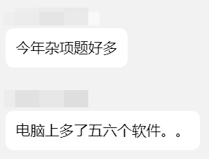